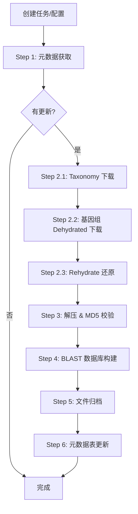

# NCBI Genome Manager (ngm)

> 可视化管理 NCBI 基因组数据下载、更新、校验与 BLAST 数据库构建的一站式工具。

[](https://www.python.org/)
[](https://fastapi.tiangolo.com/)
[](https://www.docker.com/)
[](LICENSE)

## 快速导航

- [功能概览](#功能概览)
- [快速开始](#快速开始)
- [命令行使用](#方式三命令行独立使用)
- [API 文档](#api-文档)
- [基因组校验](#基因组完整性校验)
- [工作流程](#工作流程)

---

## 功能概览

| 模块 | 说明 |
|------|------|
| **Web 管理后台** | 基于 FastAPI 的 Web UI，支持任务创建、执行、监控与日志查看 |
| **命令行下载器** | 独立的命令行工具，批量下载/更新 NCBI 基因组数据 |
| **Taxonomy 下载** | 分批并行下载 NCBI Taxonomy 分类信息 |
| **BLAST 数据库** | 自动构建 `makeblastdb` 数据库 |
| **MD5 完整性校验** | 下载后自动校验文件完整性，支持独立校验工具 |
| **自动更新调度** | 内置定时调度器，可按配置自动检查与更新 |
| **Docker 部署** | 提供 Dockerfile 与 docker-compose，一键部署 |

---

## 项目结构

```
ncbi-genome-manager/
├── genome_manager/          # FastAPI Web 后端
│   ├── main.py              # 应用入口，路由注册，生命周期管理
│   ├── models.py            # Pydantic 数据模型
│   ├── database.py          # SQLite 数据库操作（aiosqlite）
│   ├── tasks.py             # 后台任务队列 + 自动更新调度器
│   ├── routers/
│   │   ├── api.py           # REST API 路由（/api/*）
│   │   └── sse.py           # Server-Sent Events 路由
│   └── static/              # 前端静态资源（HTML/CSS/JS）
│       ├── admin.html
│       ├── login.html
│       ├── setup.html
│       ├── stats.html
│       ├── app.js
│       └── style.css
├── genome_downloader/       # 核心下载引擎（可独立使用）
│   ├── __init__.py          # 包入口，导出公共 API
│   ├── __main__.py          # python -m genome_downloader 入口
│   ├── cli.py               # argparse 命令行解析
│   ├── deps.py              # NCBI 工具依赖检查与自动安装
│   ├── metadata.py          # 元数据获取、解析、更新计划
│   ├── taxonomy.py          # Taxonomy 分批并行下载
│   ├── downloader.py        # 基因组 Dehydrated 下载 + Rehydrate
│   ├── processor.py         # 解压 / MD5 校验 / BLAST 建库
│   ├── repository.py        # 文件归档 / 索引重建 / 元数据表
│   ├── exceptions.py        # 自定义异常类
│   ├── logger.py            # 终端彩色日志
│   └── utils.py             # 工具函数
├── bins/                    # NCBI 命令行工具（datasets, dataformat 等）
├── docker/                  # Docker 构建与部署脚本
│   ├── runtime.Dockerfile   # 运行时镜像
│   ├── entrypoint.sh        # 容器入口脚本
│   ├── build-and-save-image.sh
│   ├── load-and-run.sh
│   └── requirements.txt
├── check_genomes.py         # 基因组完整性 & BLAST 数据库校验工具
├── mobilome_ncbi_genome_update.py  # 向后兼容入口脚本
├── docker-compose.yml       # Docker Compose 部署配置
├── requirements.txt         # Python 运行时依赖
└── README.md
```

---

## 快速开始

### 环境要求

- **Python** ≥ 3.12
- **NCBI 命令行工具**: `datasets`, `dataformat`（会自动下载到 `bins/` 目录）
- **BLAST+**: `makeblastdb`, `blastdbcmd`（会自动下载到 `bins/` 目录）
- **SQLite** ≥ 3.35（支持 `aiosqlite`）
- 可选：**Docker** ≥ 20.10（用于容器化部署）

### 方式一：Docker 部署（推荐）

```bash
# 1. 构建镜像
cd docker && bash build-and-save-image.sh

# 2. 启动服务
cd .. && docker compose up -d

# 3. 访问管理后台
# 打开浏览器访问 http://localhost:8000
```

首次访问需完成管理员初始化设置。环境变量可通过 `docker-compose.yml` 配置：

| 环境变量 | 说明 | 默认值 |
|----------|------|--------|
| `NGM_SECRET_KEY` | Session 加密密钥 | `change-me-before-production` |
| `NGM_ADMIN_USER` | 管理员用户名 | 首次访问时设置 |
| `NGM_ADMIN_PASSWORD` | 管理员密码 | 首次访问时设置 |
| `NCBI_TOOLS_DIR` | NCBI 工具存放目录 | `APP_DIR/bins` |

### 方式二：本地运行

```bash
# 1. 安装 Python 依赖
pip install -r requirements.txt

# 2. 启动 Web 服务
uvicorn genome_manager.main:app --host 0.0.0.0 --port 8000

# 3. 访问管理后台
# http://localhost:8000
```

### 方式三：命令行独立使用

```bash
# 通过入口脚本
python mobilome_ncbi_genome_update.py --taxon fungi --genome_dir /data/fungi

# 或直接调用包
python -m genome_downloader --taxon bacteria --genome_dir /data/bacteria --genome_type all --threads 8
```

#### 命令行参数

| 参数 | 类型 | 必需 | 说明 |
|------|------|------|------|
| `--taxon` | str | ✅ | 分类单元，如 `fungi`、`bacteria` |
| `--genome_dir` | str | ✅ | 基因组本地存储目录 |
| `--genome_type` | str | ❌ | `ref`（参考基因组）/ `all`（全部），默认 `ref` |
| `--threads` | int | ❌ | 并行线程数，默认 4 |
| `--batch_size` | int | ❌ | Taxonomy 每批 TaxID 数量，默认 500 |
| `--overwrite` | flag | ❌ | 强制覆盖已有文件 |
| `--tmp_dir` | str | ❌ | 临时工作目录 |
| `--api_key` | str | ❌ | NCBI API Key（提升请求频率限制） |
| `--skip_check` | flag | ❌ | 跳过更新检查步骤 |
| `--skip_download` | flag | ❌ | 跳过下载步骤 |
| `--skip_process` | flag | ❌ | 跳过处理步骤 |
| `--validate_db` | flag | ❌ | 额外校验 BLAST 数据库完整性 |

---

## 基因组完整性校验

独立校验工具 `check_genomes.py` 可对已下载的基因组进行完整性检查：

```bash
# 全量检查（完整性 + BLAST 数据库）
python check_genomes.py --genome-dir /data/genomes/fungi --mode all --threads 8

# 仅检查 MD5 完整性
python check_genomes.py -d /data/genomes/fungi -m integrity -t 4

# 仅校验 BLAST 数据库
python check_genomes.py -d /data/genomes/fungi -m blast -t 4 -v
```

---

## API 文档

启动 Web 服务后，可访问以下地址查看交互式 API 文档：

- **Swagger UI**: `http://localhost:8000/api/docs`
- **ReDoc**: `http://localhost:8000/api/redoc`
- **OpenAPI JSON**: `http://localhost:8000/api/openapi.json`

### 主要 API 端点

| 方法 | 路径 | 说明 |
|------|------|------|
| `GET` | `/api/tasks` | 获取任务列表 |
| `POST` | `/api/tasks` | 创建下载任务 |
| `GET` | `/api/tasks/{id}` | 获取任务详情 |
| `DELETE` | `/api/tasks/{id}` | 删除任务 |
| `GET` | `/api/tasks/{id}/logs` | 获取任务日志 |
| `GET` | `/api/configs` | 获取分类配置列表 |
| `POST` | `/api/configs` | 创建分类配置（自动更新） |
| `GET` | `/api/genomes` | 获取基因组列表 |
| `GET` | `/api/stats` | 获取统计数据 |
| `GET` | `/api/sse/tasks` | SSE 实时任务状态推送 |
| `POST` | `/api/setup` | 管理员初始设置 |

---

## 工作流程



---

## 开发

```bash
# 克隆仓库
git clone <repo-url> && cd ncbi-genome-manager

# 安装依赖
pip install -r requirements.txt

# 开发模式启动（热重载）
UVICORN_RELOAD=true uvicorn genome_manager.main:app --host 0.0.0.0 --port 8000 --reload
```

---

## 许可证

本项目基于 [MIT License](LICENSE) 开源。
